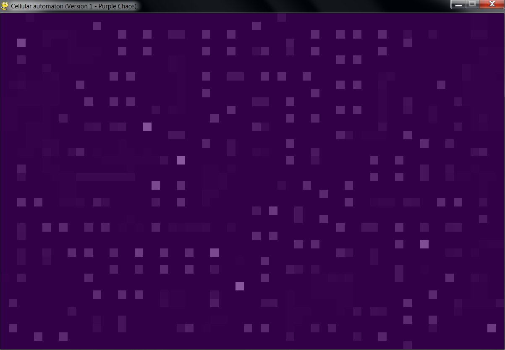
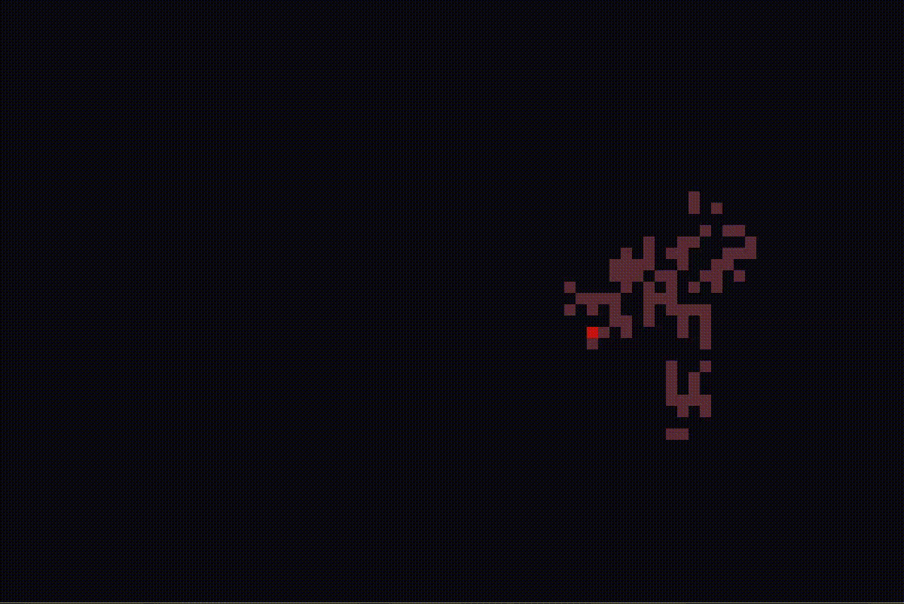

# Cellular automata exploration

## Automaton 1 - Purple Chaos (with sound)
Multiple state automaton with extended Moore neighbourhood. Rules were constructed on the spot, so nothing fancy comes out from it yet. This automaton will be improved.

## Automaton 2 - Game of Life
Classical Conway's rules, i.e.
* if cell is dead and has exactly three neighbors then it will be alive in the next generation
* if cell is alive and has less than two or more than three neighbors then it will die
* otherwise cell doesn't change its state

## Automaton 3 - Langton's ant
Langton's ant performes two-dimensional random walk. Each cell changes its state after the ant's visit.

