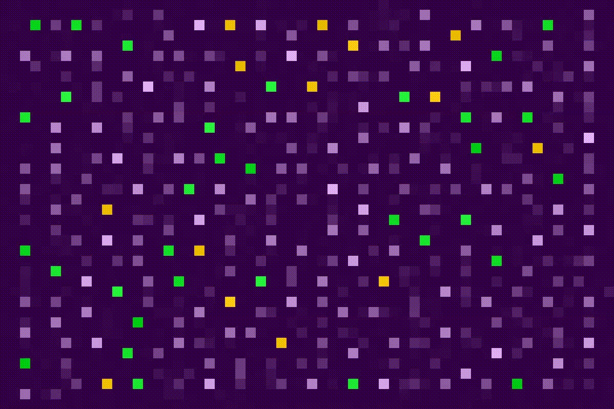

# Cellular automata exploration

## Automaton 1 - Purple Chaos (with sound)
Multiple state automaton with extended Moore neighbourhood. Rules were constructed on the fly, so nothing fancy comes out.

## Automaton 2 - Game of Life
Classical Conway's rules, i.e.
* If cell is dead and has exactly three neighbors then it will be alive in the next generation.
* If cell is alive and has less than two or more than three neighbors then it will die.
* Otherwise cell doesn't change its state.

## Automaton 3 - Langton's ant
Another famous chaotic system. Langton's ant performes random walk on a two-dimensional lattice that is initially empty. Each cell changes its state after the ant's visit (form 0 to 1 and vice versa).

